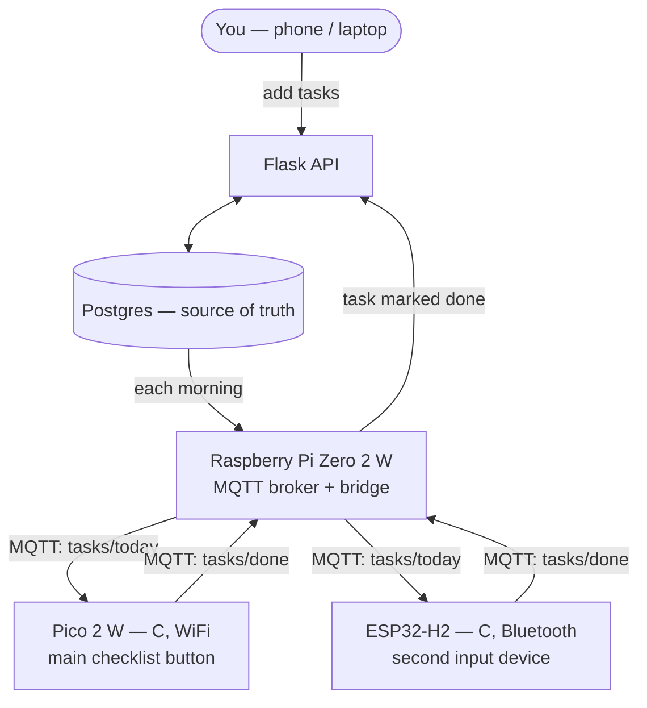

# Daily Checklist Device

A physical desk device that shows today's task list and lets you mark tasks
done with a button — no app, no phone, just a screen and a button on the desk.
The list changes every day because it's pulled from a real database, not
hardcoded into the firmware.

Two input devices report in over two different radios (WiFi and Bluetooth),
unified by a Raspberry Pi gateway — a small-scale version of how real
heterogeneous IoT systems are actually built, not just a single board doing
everything.

## Architecture

The Pi is doing real work here, not just sitting in the middle for practice —
it's the only thing that can speak to *both* radios, so it's what makes two
different input devices actually usable as one system.

## Why staged

Building WiFi + Bluetooth + MQTT + a Pi service + Flask + a database all at
once means that when something breaks, it's unclear which of five-plus new
things actually failed. Each version below proves exactly one new layer
before the next one gets added.

| Version | What it adds | Status |
|---|---|---|
| **v1** | Pico 2 W + one button, native Pico C SDK. Connects to WiFi, sends a direct HTTP POST to Flask on button press. No Pi, no MQTT yet — just proving button → WiFi → API → database works end to end. | 🔧 In progress |
| **v2** | Pi Zero 2 W joins as an MQTT broker + bridge. Tasks get pulled from Postgres each morning and pushed to the Pico over MQTT instead of being hardcoded. The ESP32-H2 joins as a second input device over Bluetooth, relayed through the same Pi. | ⏳ Planned |
| **v3** | Polish — a touchscreen (swapping in a "Cheap Yellow Display," an ESP32 with a built-in 2.8" screen), a real enclosure, streak/carry-over logic. | ⏳ Planned |
| **v4** | Optional deepening pass: rewrite the Pi's bridge in C, cross-compiled for ARM, as a proper systemd service — and, as a stretch goal, a custom Buildroot Linux image instead of stock Raspberry Pi OS. | ⏳ Stretch goal |

## Hardware

| Board | Role | Why this one |
|---|---|---|
| **Raspberry Pi Pico 2 W** (RP2350) | Main checklist input — the button lives here | WiFi confirmed working via the onboard CYW43439 chip. Built on the **native Pico C SDK** rather than the Arduino framework — Arduino-for-Pico is itself just a wrapper around this same SDK, so building directly on it means real low-level C practice instead of an abstraction over it. |
| **ESP32-H2-DevKitM-1** | Second input device, over Bluetooth | This chip has Bluetooth LE + 802.15.4 (Zigbee/Thread) but genuinely **no WiFi radio** — a mismatch discovered the hard way after assuming it was a plain WiFi board. Rather than shelving it, it became the reason the Pi's gateway role is load-bearing: something has to translate between two radios that can't talk to each other directly. |
| **Raspberry Pi Zero 2 W** | Gateway — MQTT broker + bridge (v2+) | The one genuine embedded-Linux board in this project — quad-core, runs a real OS, not just a microcontroller loop. |
| **Arduino Uno R4 WiFi** | In reserve | Has WiFi + Bluetooth via an onboard ESP32-S3 co-processor. Backup WiFi node if Pico library gaps become a problem, or a future third input device. |

## Tooling

| Tool | Why |
|---|---|
| **VS Code + the official Raspberry Pi Pico extension** (not PlatformIO) | PlatformIO's `raspberrypi` platform only supports the original RP2040 Pico through the Arduino framework — no Pico 2 W (RP2350) board definition, no native-SDK option. The official extension wraps the real `pico-sdk` + CMake + Ninja with proper RP2350 support. |
| **Native Pico C SDK**, not the Arduino framework | Chosen deliberately for lower-level C practice over convenience — this project is as much about strengthening C fundamentals as it is about the finished device. |
| **Flask + Postgres** (v1+, backend) | Reuses patterns from an earlier finished project, [IoT Telemetry & Analytics Platform](https://github.com/aliazam94j/iot-telemetry-platform), rather than a framework picked just for this one. |

## A note on scope

Some of this could be built faster with more Arduino-style abstractions, or by
skipping the Pi gateway and just using one WiFi board. That's a deliberate
trade — the point of this project is practicing the harder tools (native C
SDK, a real Linux gateway, MQTT, two different radio stacks), not shipping
the fastest possible checklist app.

## Status

**v1 — in progress.** WiFi connect is working on the Pico 2 W (native SDK,
`cyw43_arch`); a debounced button read and an LED toggle are both verified on
real hardware. Next: the direct HTTP POST to Flask on button press, plus
standing up the Flask API itself.
